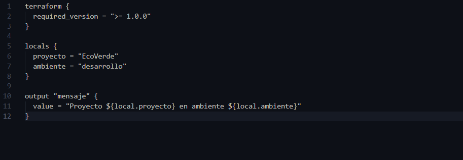
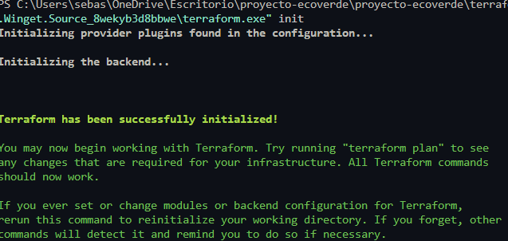
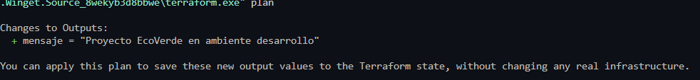
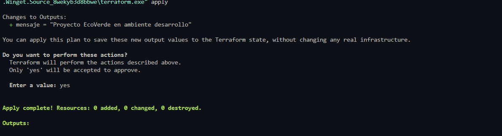
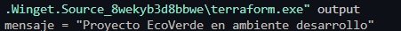

# Semana 10 - Introducción a Terraform

## Objetivo

Comprender el funcionamiento básico de Terraform mediante la creación de una configuración sencilla, inicializando el entorno de trabajo y ejecutando los comandos principales para generar un plan de infraestructura y administrar el estado de Terraform.

---

# Actividades realizadas

- Se instaló Terraform en el equipo de trabajo.
- Se creó la carpeta `terraform` dentro del proyecto.
- Se elaboró el archivo `main.tf` con una configuración básica utilizando un bloque `output`.
- Se inicializó el directorio de trabajo mediante `terraform init`.
- Se generó el plan de ejecución con `terraform plan`.
- Se aplicó la configuración utilizando `terraform apply`.
- Se verificó el resultado mediante `terraform output`.

---

# Estructura utilizada

```text
proyecto-ecoverde/
│
├── terraform/
│   ├── main.tf
│   ├── .terraform/
│   ├── .terraform.lock.hcl
│   └── terraform.tfstate
│
├── app/
├── evidencias/
└── ...
```

---

# Archivo principal

Se creó el archivo `main.tf` con el siguiente contenido:

```hcl
terraform {
  required_version = ">= 1.0"
}

output "mensaje" {
  value = "Proyecto EcoVerde en ambiente desarrollo"
}
```

# Estructura Terraform




---

# Comandos ejecutados

Inicialización del proyecto:

```bash
terraform init
```



Generación del plan:

```bash
terraform plan
```



Aplicación de la configuración:

```bash
terraform apply
```



Consulta de los valores de salida:

```bash
terraform output
```



---

# Resultados obtenidos

Terraform inicializó correctamente el entorno de trabajo.

Se generó el plan indicando la creación del valor de salida:

```text
mensaje = "Proyecto EcoVerde en ambiente desarrollo"
```

Después de ejecutar `terraform apply`, Terraform registró el estado correctamente y mostró el resultado configurado.

Finalmente, mediante `terraform output` se confirmó el valor generado.

---

# Evidencias

Las evidencias del laboratorio se encuentran en:

```
evidencias/img/
```

Se incluyen capturas de:

- Instalación de Terraform.
- Ejecución de `terraform init`.
- Resultado de `terraform plan`.
- Ejecución de `terraform apply`.
- Consulta mediante `terraform output`.

---

# Conclusiones

- Se comprendió el flujo básico de trabajo de Terraform.
- Se aprendió el proceso de inicialización de un proyecto mediante `terraform init`.
- Se verificó el funcionamiento del comando `terraform plan` para visualizar los cambios antes de aplicarlos.
- Se ejecutó correctamente `terraform apply`, generando el estado de Terraform.
- Se comprobó el uso de `terraform output` para consultar los valores definidos en la configuración.
- Terraform permite gestionar infraestructura como código de forma organizada, reproducible y sencilla.
