# Semana 5 - Introducción a Docker

## Objetivo

Construir un entorno básico utilizando Docker para desplegar una página web institucional, aplicando Git como sistema de control de versiones y Docker Compose para la administración del servicio.

---

# Actividades realizadas

- Se creó el repositorio del proyecto en GitHub.
- Se inicializó el proyecto con Git.
- Se creó la rama de desarrollo `dev-sebas`.
- Se diseñó una página web institucional para EcoVerde Antioquia S.A.S.
- Se construyó una imagen Docker mediante un Dockerfile.
- Se ejecutó un contenedor utilizando la imagen creada.
- Se verificó el funcionamiento de la aplicación en el navegador.
- Se creó un volumen Docker para persistencia.
- Se creó una red Docker personalizada.
- Se desplegó el proyecto mediante Docker Compose.

---

# Evidencias

## Evidencia 1 - Estructura inicial del proyecto

> 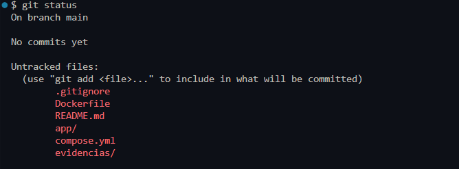

---

## Evidencia 2 - Primer commit y publicación del repositorio

> 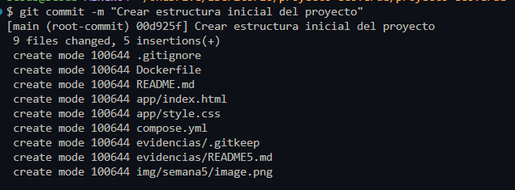

---

## Evidencia 3 - Historial de commits

Comando ejecutado:

```bash
git log --oneline
```

> 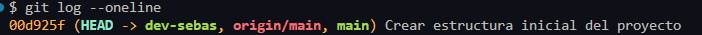

---

## Evidencia 4 - Página web institucional

> 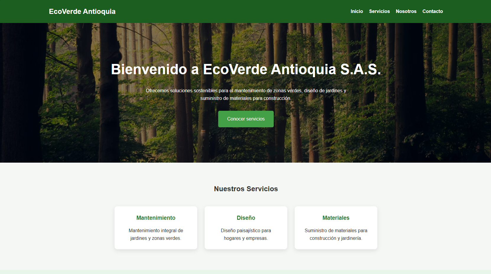

---

## Evidencia 5 - Imagen Docker

Comando ejecutado:

```bash
docker images
```

> 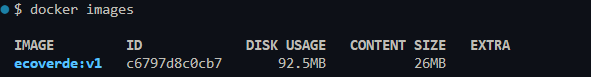

---

## Evidencia 6 - Contenedor en ejecución

Comando ejecutado:

```bash
docker ps
```

> 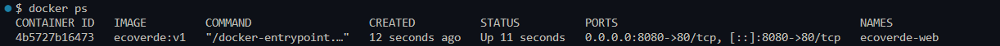


> 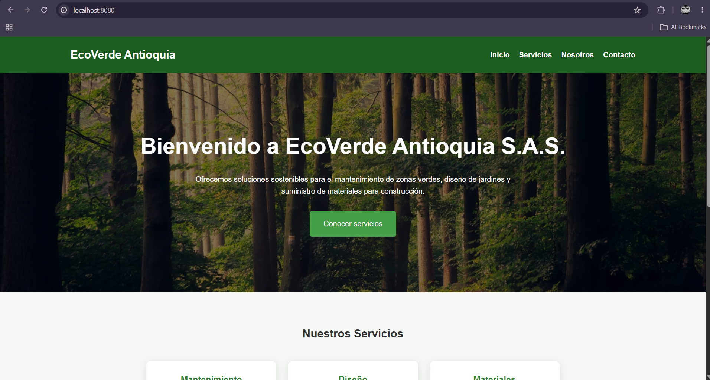

---

## Evidencia 7 - Volumen Docker

Comando ejecutado:

```bash
docker volume ls
```

> 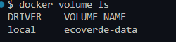

> 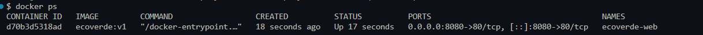

---

## Evidencia 8 - Red Docker

Comando ejecutado:

```bash
docker inspect ecoverde-web
```

> 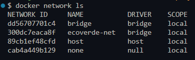

> 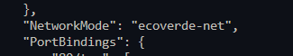
---

## Evidencia 9 - Docker Compose

Comando ejecutado:

```bash
docker compose ps
```

> 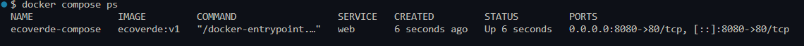

---

# Conclusión

Durante esta semana se logró implementar un entorno básico de contenerización utilizando Docker. Se creó una página web institucional, se construyó una imagen personalizada, se ejecutó un contenedor, se configuraron volúmenes y redes para el servicio, y finalmente se automatizó el despliegue mediante Docker Compose. Estas actividades permitieron comprender el flujo básico de trabajo con Docker y sentar las bases para las siguientes etapas del proyecto DevOps.