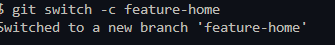
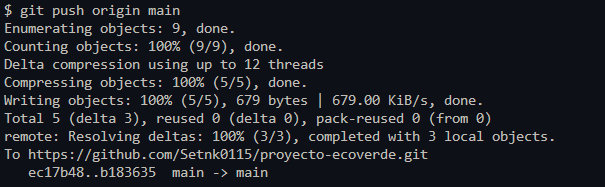

# Semana 6 - Flujo de trabajo con ramas en Git

## Objetivo

Aplicar un flujo de trabajo basado en ramas utilizando Git y GitHub para desarrollar nuevas funcionalidades de forma independiente y posteriormente integrarlas en la rama principal del proyecto.

---

# Actividades realizadas

- Se actualizó la rama `main` con los cambios del repositorio remoto.
- Se creó la rama `feature-home`.
- Se implementó una nueva sección denominada **Novedades** en la página principal.
- Se realizaron los cambios en una rama independiente.
- Se registró un nuevo commit con la funcionalidad desarrollada.
- Se realizó el merge de la rama `feature-home` hacia `main`.
- Se verificó el historial de commits.
- Se publicaron los cambios en GitHub.

---

# Evidencias

## Evidencia 1 - Creación de la rama feature-home



---

## Evidencia 2 - Historial de commits

Comando ejecutado:

```bash
git log --oneline --graph
```


---

## Evidencia 3 - Publicación en GitHub

Comando ejecutado:

```bash
git push origin main
```



---

## Evidencia 4 - Nueva funcionalidad

Se agregó la sección **Novedades** en la página principal de la aplicación.


---

# Conclusión

Durante esta semana se aplicó un flujo de trabajo basado en ramas mediante Git. Se desarrolló una nueva funcionalidad en una rama independiente, posteriormente se integró mediante un proceso de merge hacia la rama principal y finalmente se sincronizó el repositorio remoto. Esta práctica permitió fortalecer el uso de Git para el trabajo colaborativo y el control de versiones.