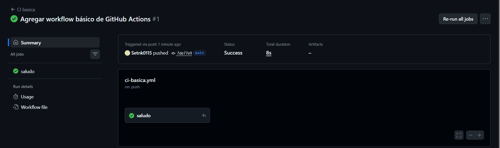
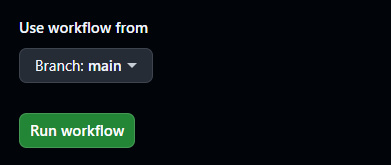
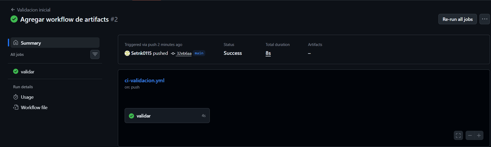
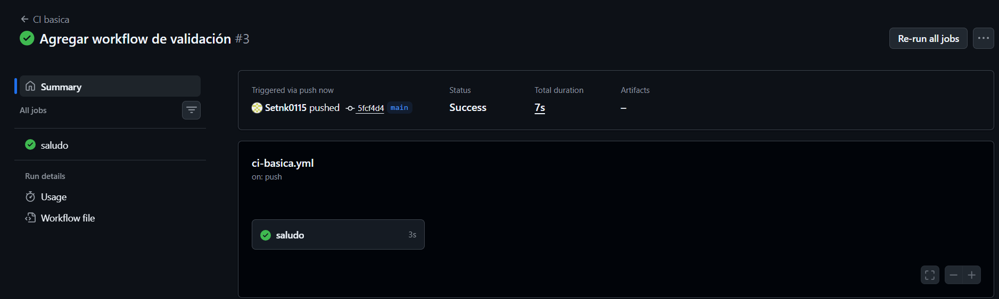
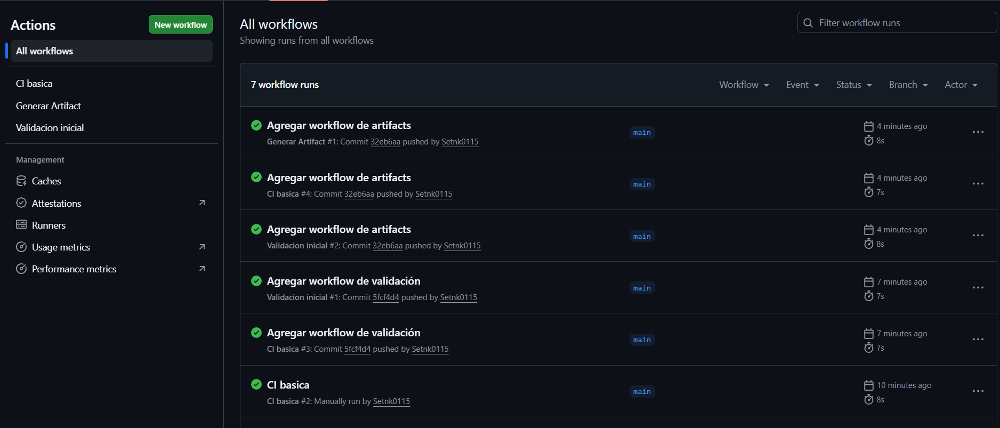

# Semana 7 - Integración Continua con GitHub Actions

## Objetivo

Implementar flujos de integración continua mediante GitHub Actions para automatizar tareas básicas del proyecto y conocer el funcionamiento de los workflows.

---

# Actividades realizadas

- Se creó la carpeta `.github/workflows`.
- Se implementó un workflow básico para ejecutar acciones al realizar un push.
- Se ejecutó manualmente un workflow utilizando `workflow_dispatch`.
- Se creó un workflow de validación del proyecto.
- Se verificó la existencia de archivos importantes del repositorio.
- Se implementó un workflow para generar y publicar un artifact.
- Se comprobaron las ejecuciones exitosas desde la pestaña **Actions** de GitHub.

---

# Evidencias

## Evidencia 1 - Workflow básico

---

## Evidencia 2 - Ejecución manual

---

## Evidencia 3 - Workflow de validación

---

## Evidencia 4 - Artifact generado

---

# Conclusión

Durante esta semana se implementaron distintos workflows utilizando GitHub Actions, permitiendo automatizar procesos básicos de integración continua. Se ejecutaron tareas de validación del proyecto, se realizaron ejecuciones manuales y se generó un artifact como resultado del flujo de trabajo, fortaleciendo los conocimientos sobre automatización dentro del proceso DevOps.