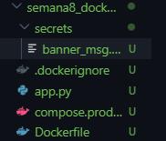
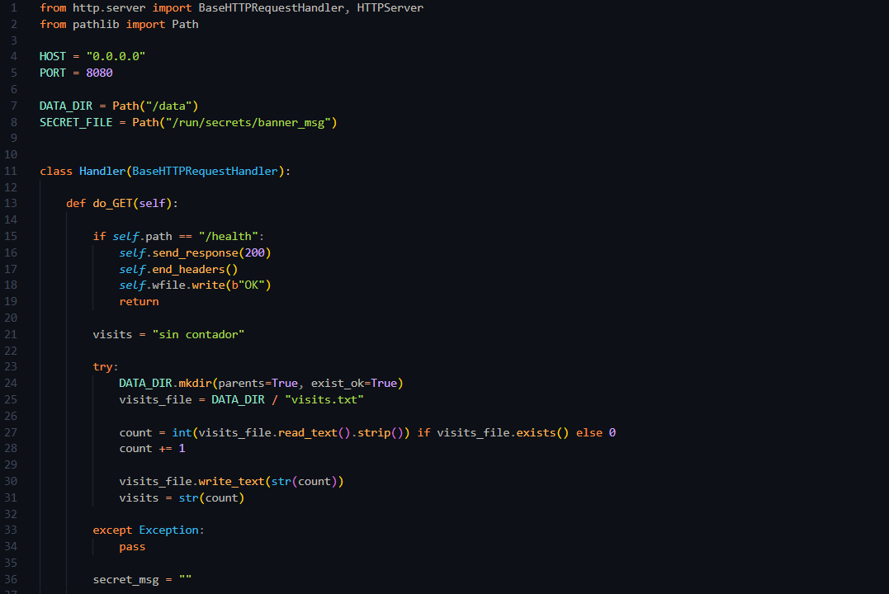
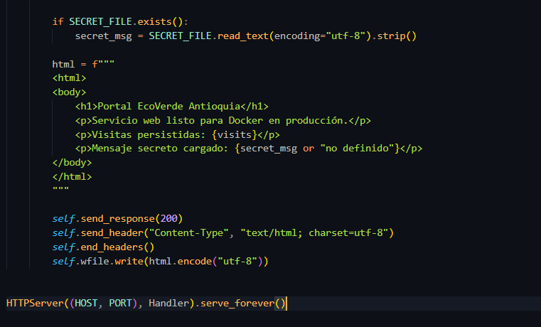
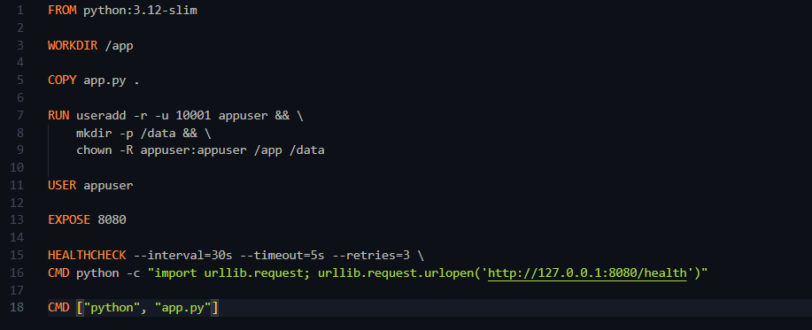
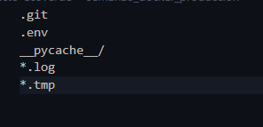
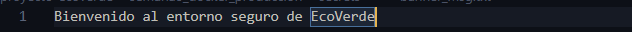
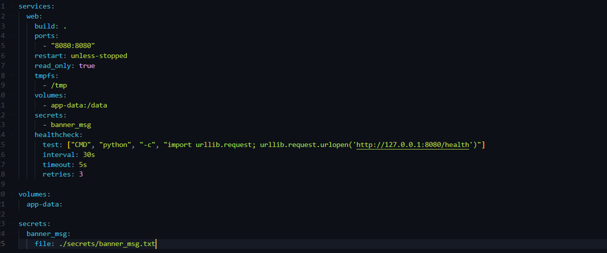
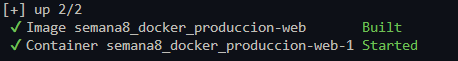
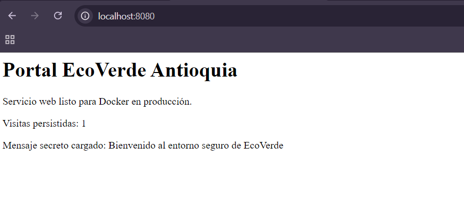
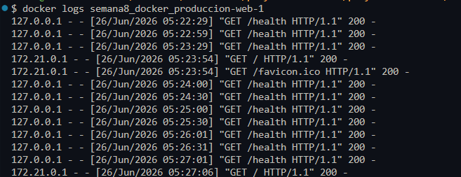

# Semana 8 - Docker para producción

## Objetivo

Implementar una aplicación preparada para un entorno de producción utilizando Docker, aplicando buenas prácticas como el uso de un usuario no privilegiado, volúmenes persistentes, secretos, healthchecks y políticas de reinicio.

---

# Actividades realizadas

- Se creó un laboratorio independiente llamado `semana8_docker_produccion`.
- Se desarrolló una aplicación web sencilla en Python.
- Se creó un Dockerfile siguiendo buenas prácticas de seguridad.
- Se implementó un archivo `.dockerignore`.
- Se configuró un archivo `compose.prod.yml`.
- Se utilizó un volumen para almacenar información persistente.
- Se implementó un secreto mediante Docker Secrets.
- Se configuró un Healthcheck para verificar el estado del servicio.
- Se ejecutó el proyecto utilizando Docker Compose.

---

# Respuestas de la actividad

## 1. Diferencias entre un entorno de desarrollo y uno de producción

Un entorno de desarrollo está orientado a crear y probar aplicaciones, permitiendo realizar cambios constantemente. En cambio, un entorno de producción está diseñado para ofrecer estabilidad, seguridad y disponibilidad a los usuarios finales.

---

## 2. ¿Por qué es importante utilizar un usuario distinto a root?

Porque disminuye el riesgo de seguridad. Si una aplicación presenta una vulnerabilidad, el atacante tendrá permisos limitados y no podrá controlar completamente el sistema.

---

## 3. ¿Para qué sirven los Docker Secrets?

Permiten almacenar información sensible, como contraseñas o claves, evitando que estos datos queden escritos directamente dentro de la imagen o del código fuente.

---

## 4. ¿Qué función cumple un Healthcheck?

Permite verificar automáticamente que la aplicación continúa funcionando correctamente. Si el servicio presenta fallos, Docker puede detectarlo rápidamente.

---

## 5. ¿Por qué utilizar volúmenes?

Los volúmenes permiten conservar la información aunque el contenedor sea eliminado o recreado, garantizando la persistencia de los datos.

---

# Evidencias

## Evidencia 1 - Estructura del laboratorio



---

## Evidencia 2 - Archivo app.py




---

## Evidencia 3 - Dockerfile



---

## Evidencia 4 - Archivos .dockerignore y banner_msg.txt





---

## Evidencia 5 - compose.prod.yml



---

## Evidencia 6 - Construcción del contenedor

```bash
docker compose -f compose.prod.yml up -d --build
```



---

## Evidencia 7 - Estado del contenedor

```bash
docker compose ps
```


---

## Evidencia 8 - Aplicación en funcionamiento



---

## Evidencia 9 - Logs del contenedor

```bash
docker logs semana8_docker_produccion-web-1
```



---

# Conclusión

Durante esta semana se desarrolló un entorno de producción utilizando Docker. Se implementaron buenas prácticas como el uso de un usuario sin privilegios, la configuración de secretos, la persistencia mediante volúmenes y la supervisión del servicio con Healthcheck. Estas configuraciones permiten construir aplicaciones más seguras, estables y preparadas para ejecutarse en ambientes reales.