# Semana 9 - Introducción a Kubernetes

## Objetivo

Comprender el funcionamiento básico de Kubernetes mediante la creación y administración de recursos dentro de un clúster local, utilizando Minikube y kubectl para desplegar, exponer y escalar aplicaciones contenerizadas.

---

# Actividades realizadas

- Se verificó la instalación y configuración de kubectl.
- Se creó un clúster local utilizando Minikube.
- Se validó el acceso al clúster de Kubernetes.
- Se consultaron los recursos básicos del clúster.
- Se creó un namespace llamado `laboratorio-k8s`.
- Se desplegó una aplicación Nginx mediante un Deployment.
- Se creó un Service de tipo ClusterIP para exponer la aplicación.
- Se accedió al servicio mediante `kubectl port-forward`.
- Se escaló el Deployment a tres réplicas.
- Se consultaron los eventos del namespace.
- Se eliminaron los recursos creados para finalizar la práctica.

---

# Respuestas de la actividad

## 1. ¿Qué es Kubernetes?

Kubernetes es una plataforma de orquestación de contenedores que permite desplegar, administrar y escalar aplicaciones de forma automática. Facilita la gestión de múltiples contenedores distribuidos en uno o varios nodos, garantizando alta disponibilidad y una administración eficiente.

---

## 2. ¿Qué es un Pod?

Un Pod es la unidad mínima de ejecución en Kubernetes. Puede contener uno o varios contenedores que comparten red, almacenamiento y recursos, ejecutándose siempre en el mismo nodo del clúster.

---

## 3. ¿Qué función cumple un Deployment?

Un Deployment administra la creación y actualización de Pods, garantizando que siempre exista el número de réplicas definido por el usuario. Además, permite realizar actualizaciones y recuperaciones automáticas cuando ocurre algún fallo.

---

## 4. ¿Para qué sirve un Service?

Un Service proporciona un punto de acceso estable para uno o varios Pods, permitiendo la comunicación entre aplicaciones o con usuarios externos sin depender de la dirección IP individual de cada Pod.

---

## 5. ¿Qué ventajas ofrece Kubernetes frente a ejecutar contenedores manualmente?

Kubernetes automatiza tareas como el despliegue, escalamiento, recuperación ante fallos, balanceo de carga y administración de recursos. Esto facilita la disponibilidad de las aplicaciones y simplifica la administración de infraestructuras basadas en contenedores.

---

# Evidencias

## Evidencia 1. Verificación de kubectl

```bash
kubectl version --client
```

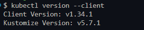

---

## Evidencia 2. Información del clúster

```bash
kubectl cluster-info
```

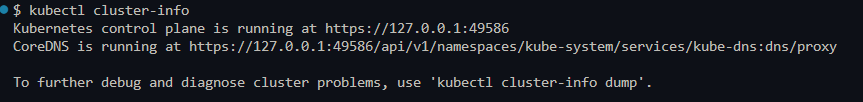

---

## Evidencia 3. Nodo del clúster

```bash
kubectl get nodes
```

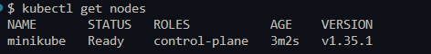

---

## Evidencia 4. Namespaces disponibles

```bash
kubectl get namespaces
```

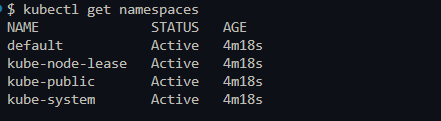

---

## Evidencia 5. Recursos iniciales

```bash
kubectl get deployments
kubectl get pods
kubectl get services
```


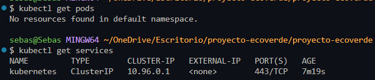

---

## Evidencia 6. Creación del namespace

```bash
kubectl create namespace laboratorio-k8s
kubectl get namespaces
```


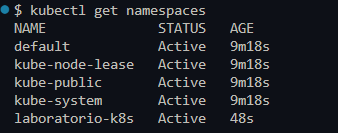

---

## Evidencia 7. Creación del Deployment

```bash
kubectl create deployment web-nginx --image=nginx -n laboratorio-k8s
kubectl get deployments -n laboratorio-k8s
kubectl get pods -n laboratorio-k8s
```

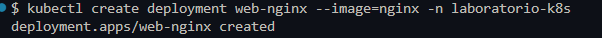
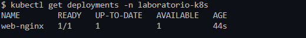
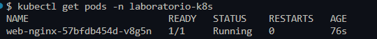

---

## Evidencia 8. Creación del Service

```bash
kubectl expose deployment web-nginx --type=ClusterIP --port=80 -n laboratorio-k8s
kubectl get services -n laboratorio-k8s
kubectl describe service web-nginx -n laboratorio-k8s
```

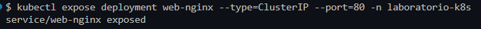
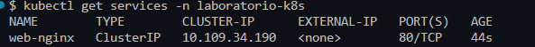
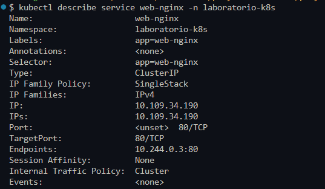

---

## Evidencia 9. Acceso mediante Port Forward

```bash
kubectl port-forward service/web-nginx 8080:80 -n laboratorio-k8s
```

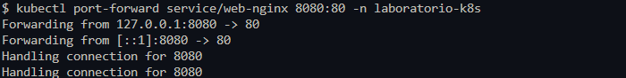

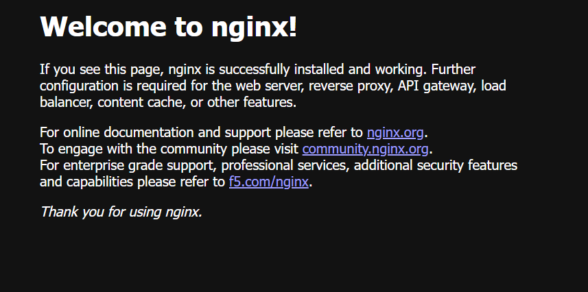

---

## Evidencia 10. Escalamiento del Deployment

```bash
kubectl scale deployment web-nginx --replicas=3 -n laboratorio-k8s
kubectl get deployments -n laboratorio-k8s
kubectl get pods -n laboratorio-k8s
```

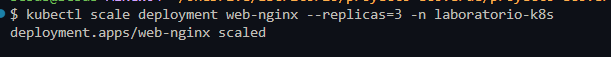
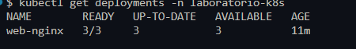
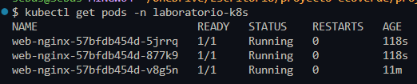

---

## Evidencia 11. Consulta de recursos y eventos

```bash
kubectl get all -n laboratorio-k8s
kubectl get events -n laboratorio-k8s
```

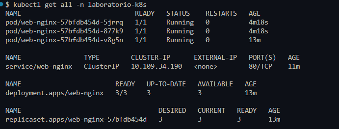
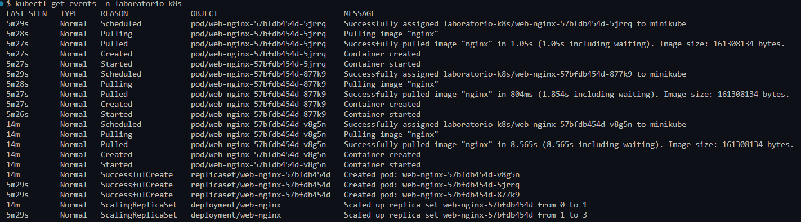

---

## Evidencia 12. Eliminación del laboratorio

```bash
kubectl delete namespace laboratorio-k8s
kubectl get namespaces
```

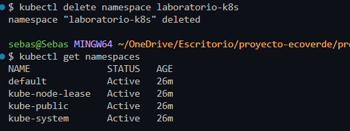

---

# Conclusión

Durante esta práctica se adquirieron los conceptos básicos de Kubernetes mediante el uso de un clúster local con Minikube. Se aprendió a crear namespaces, desplegar aplicaciones utilizando Deployments, exponer servicios mediante Services, acceder a las aplicaciones utilizando port-forward y escalar réplicas de forma automática. Finalmente, se eliminaron los recursos creados, comprendiendo el ciclo completo de administración de aplicaciones dentro de Kubernetes.